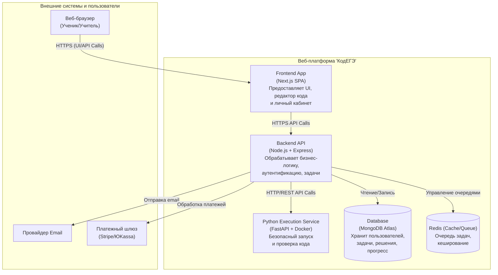
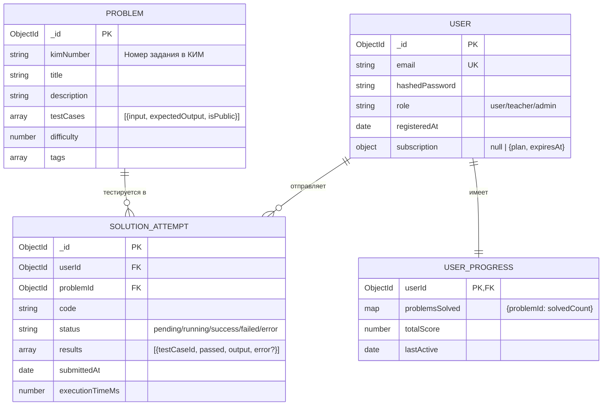
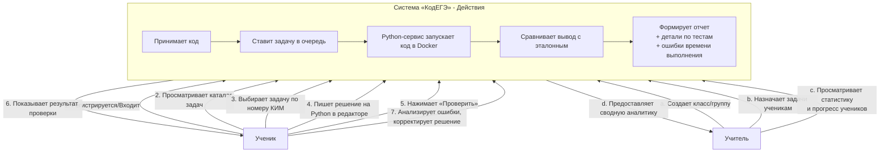
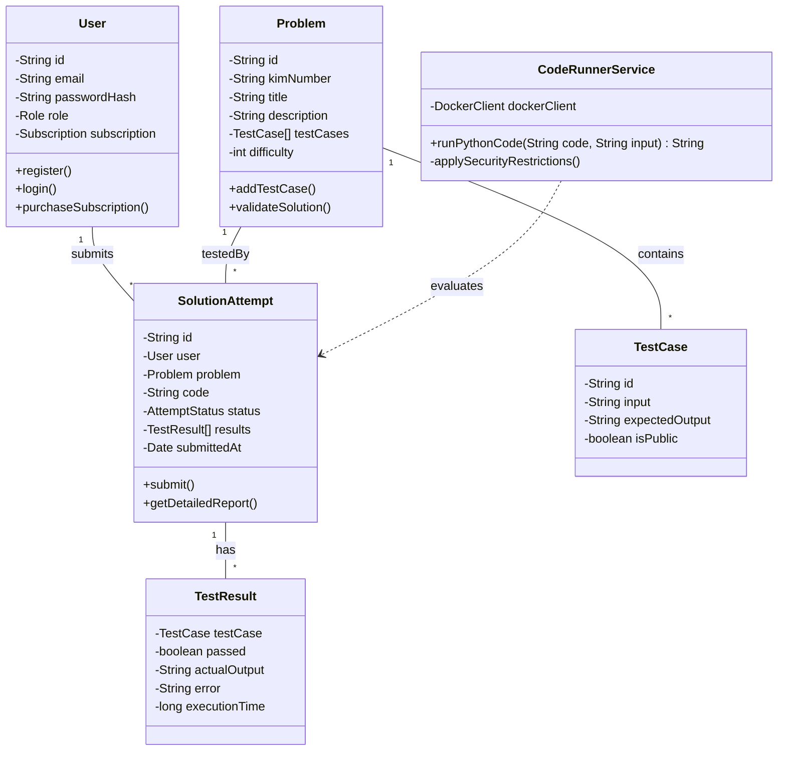

# Документация проекта «КодЕГЭ»

## 1. Концепция проекта (Развернутый шаблон)

**1. Миссия:**  
Сделать подготовку к ЕГЭ по информатике эффективной, интерактивной и доступной для каждого школьника, предоставив мгновенную обратную связь по выполненным заданиям.

**2. Видение:**  
Стать ведущей российской онлайн-платформой для подготовки к экзаменам по программированию, где ученики могут практиковаться в решении задач с автоматической проверкой в реальном времени.

**3. Целевая аудитория:**  
*   **Основная:** Ученики 9-11 классов, готовящиеся к ОГЭ и ЕГЭ по информатике.
*   **Вторичная:** Учителя информатики, репетиторы.
*   **Косвенная:** Родители школьников.

**4. Проблемы, которые мы решаем:**
*   **Для учеников:** Отсутствие мгновенной обратной связи, страх перед программированием, сложность самостоятельной подготовки к конкретным задачам КИМ.
*   **Для учителей:** Нехватка времени на индивидуальный разбор ошибок каждого ученика в коде.

**5. Ключевые ценности для пользователя:**
*   **Эффективность:** Практика на актуальных задачах из банка ФИПИ.
*   **Обратная связь:** Мгновенная проверка решений с детальными комментариями.
*   **Безопасность:** Код выполняется в изолированной среде без риска для системы.
*   **Удобство:** Все инструменты (редактор, задачи, теория) собраны в одном месте.

**6. Каналы взаимодействия с клиентом:**
*   **Основной:** Веб-платформа (браузер).
*   **Поддержка:** Чат/форма обратной связи на сайте, email-рассылка (уведомления, советы).
*   **Продвижение:** Сообщества учителей в соцсетях (VK, Telegram), SEO, партнерства с образовательными блогами.

**7. Конкурентные преимущества:**
*   **Уникальное технологическое ядро:** Встроенный безопасный компилятор (интерпретатор Python) с изоляцией в Docker.
*   **Фокус на ЕГЭ:** Содержание строго соответствует структуре КИМ и актуальным требованиям.
*   **Глубокая аналитика:** Ученик и учитель видят не просто результат (правильно/неправильно), а детали выполнения, ошибки и прогресс по темам.

---

## 2. Схема контейнеров (C4 Model: Container Diagram)

---

## 3. Компонентная схема данных (Документы и связи в MongoDB)

---

## 4. Контекстная схема (C4 Model: Context Diagram)

**Предметная область:** Онлайн-обучение и аттестация навыков программирования на Python в контексте стандартизированного государственного экзамена (ЕГЭ/ОГЭ). Система автоматизирует самый ресурсоемкий этап подготовки — проверку практических заданий — и предоставляет структурированный путь обучения на основе официальных экзаменационных материалов.

---

## 5. Диаграмма классов (Упрощенная, ключевые сущности)

---

## 6. Клиентский путь (Customer Journey Map) для ученика «Новичок»

### **RFM-Сегментация для маркетинга:**

*   **Чемпионы (Высокий R, F, M):** Постоянно занимаются, купили подписку.  
    **Действие:** Персональная благодарность, доступ к бета-тестам, referral-программа.

*   **Потерянные (Низкий R, F, M):** Зарегистрировались, но не решали задачи.  
    **Действие:** Email-напоминание с подборкой легких задач, скидка на первый месяц.

*   **Новички (Высокий R, Низкий F, M):** Недавно купили подписку.  
    **Действие:** Онбординг-письма, приглашение на вебинар, помощь в настройке.

*   **Лояльные (Высокий R, F, Низкий M):** Много решают, но на бесплатном тарифе.  
    **Действие:** Предложение trial-подписки с доступом к симулятору экзамена.

### **Таблица CJM**

| **Стадия** | **Действия (Touchpoints)** | **Мысли (Thinking)** | **Эмоции (Feeling)** | **Болевые точки (Pain Points)** | **Возможности (Opportunities)** |
|------------|----------------------------|----------------------|----------------------|----------------------------------|----------------------------------|
| **1. Осведомленность** | Видит рекламу в паблике учителя информатики ВК, ищет в Google «решение задач ЕГЭ Python». | «Нужно готовиться к ЕГЭ. Может, есть что-то удобнее учебника?» | Надежда, Любопытство | Много разрозненных сайтов, нет уверенности в качестве. | SEO-оптимизация, контент в соцсетях для учителей. |
| **2. Знакомство** | Заходит на сайт, читает описание, смотрит скриншоты интерфейса, пробует демо-задачу. | «Интерфейс выглядит современно. Интересно, как работает проверка?» | Интригованность, Удивление | Демо-задача может быть слишком простой или сложной. | Яркая, понятная демо-задача с первого клика. Видео-презентация платформы. |
| **3. Регистрация** | Регистрируется через email. Получает письмо для подтверждения. | «Надеюсь, это не займет много времени. Хочу быстрее попробовать.» | Целеустремленность, Легкое раздражение | Лишние шаги при регистрации. | Быстрая регистрация (email + пароль) или через соцсети. Доброе onboarding-письмо. |
| **4. Первая задача** | Выбирает первую задачу из каталога. Открывает редактор кода. Пишет решение, нажимает «Проверить». | «Справился ли мой код? Что, если я сделал глупую ошибку?» | Волнение, Сомнение | Ожидание результата проверки (если долго). Непонятное сообщение об ошибке. | **Ключевой момент:** Мгновенный или очень быстрый ответ. Четкие, обучающие сообщения об ошибках (синтаксис, логика). |
| **5. Получение фидбека** | Видит результат: «3 из 5 тестов пройдено». Кликает, чтобы увидеть детали по каждому тесту. | «Почему этот тест не прошел? А, вот где ошибка! Теперь понятно, как исправить.» | Сначала: Разочарование. Затем: Просветление, Удовлетворение | Если фидбек формальный («Wrong Answer») без деталей. | Визуальное выделение пройденных/непройденных тестов. Подсказки к типовым ошибкам. Ссылка на теорию. |
| **6. Прогресс** | Решает еще несколько задач. Видит, как заполняется прогресс-бар в личном кабинете. | «Класс, я решил уже 10 задач! Видно, как расту. Хочу получить достижение.» | Гордость, Вдохновение, Радость | Прогресс неочевиден или не мотивирует. | Система достижений, визуализация прогресса (графики, значки). Рейтинг среди одноклассников (опционально). |
| **7. Монетизация** | Видит ограничение на сложные задачи или пробный экзамен. Предложение оформить подписку. | «Хочу продолжить заниматься. Стоит ли платить? Цена вроде адекватная.» | Амбициозность, Неловкость (при отказе) | Неожиданное ограничение функционала. Сложный процесс оплаты. | Прозрачное объяснение тарифов. Бесплатный пробный период подписки. Простая интеграция с ЮKassa. |

---